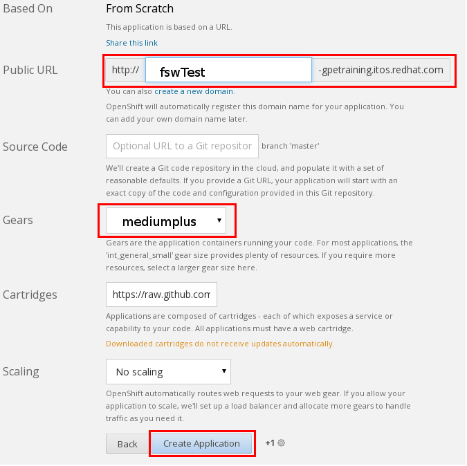

:data-uri:
:toc2:
:jbossbpmsoarpmbuild: link:https://github.com/jboss-gpe-ose/jboss_bpm_soa_rpmbuild[jboss_bpm_soa_rpmbuild]
:mysqlrpmbuild}: link:https://github.com/jboss-gpe-ose/mysql_module_rpmbuild[mysql_module_rpmbuild]
:fswrpmbuild: link:https://github.com/jboss-gpe-ose/fsw_rpmbuild[fsw_rpmbuild]
:rhctools: link:https://access.redhat.com/site/documentation//en-US/OpenShift_Enterprise/2/html/Client_Tools_Installation_Guide/chap-OpenShift_Client_Tools.html[RHC Tools]
:partnercenter: link:https://www.redhat.com/wapps/sfconnector/partner/login.html[RHT Partner Center]

image::images/rhheader.png[width=900]

:numbered!:
[abstract]
== openshift-origin-cartridge-fsw-full

== Summary:

. This project provides a community developed Openshift Enterprise 2.* cartridge for Red Hat JBoss Fuse Service Works.
This  _downloadable_ cartridge will only work in on-premise Openshift Enterprise environments where a few custom, non-Red Hat-supported "ghetto" RPMs can be installed.  
So, for instance, this cartridge will not work on any service plan offered by Openshift Online.
. The purpose of these custom, non-supported RPMs that this FSW cartridge depends on is to pre-install JBoss EAP6.1.1 and FSW on each Openshift node.  
The benefit of this approach is that these bits do not need to be bundled in the downloadable cartridge itself. 
Subsequently, creating a new FSW application in Openshift Enterprise can occur quickly.  
Quick provisioning of FSW environments may prove valuable in scenarios where you may need many instances of FSW.
. This cartridge does not rely on the JBoss EAP available through the jbappplatform channel of the Red Hat Network.  
The release cycle of JBoss EAP from that channel is not in sync with releases of FSW  
ie:  to-date, the version of EAP available from the jbappplatform channel is 6.2.  
FSW has a hard-requirement on EAP 6.1.1 specifically.
. Red Hat has other active initiatives to create a supported FSW cartridge.  
Please contact your Red Hat sales representative for more details regarding these supported options.
. This cartridge assumes co-installation of the mysql Openshift cartridge.  
Subsequently, FSW is configured to leverage mysql rather than H2.
. The JBoss EAP Management Console has been mapped to port 8080 (as opposed to being mapped to the default port of 9990).
This allows for access to the JBoss EAP Management Console without the need for port-forwarding and without authentication.
If this is not desirable, feel free to disable this mapping of the EAP Management Console in your own fork of this cartridge.

== Pre-Requisities:
. An Openshift Enterprise 2.* environment installed with the following custom RPMs:
.. {jbossbpmsoarpmbuild}
.. {mysqlrpmbuild}
.. {fswrpmbuild}
. Your Openshift Enterprise 2.* needs to support medium sized gears (ie:  1G of RAM and 1G of disk space per gear) at the very minimum.
This cartridge has been tested in an OSE 2.* environment where 1.2G of RAM are allocated to the FSW gear.
. An OSE district should be created so that gears can be freely moved from one node to another.
. {rhctools} installed in your local environment

[IMPORTANT]
Red Hat's _Partner Demonstration System_ provides Red Hat partners with freely available Openshift Enterprise environment that already meet the first three pre-requisites.
If you are a Red Hat Partner, please visit {partnercenter} for more details. 

== Getting Started:
Once the above pre-reqs are met, provisioning of a FSW environment is easy.  
You have the following two options:

=== Provision via rhc tooling 

Execute the following at the command-line of your local environment:

-----
rhc app create fsw0 https://raw.github.com/jboss-gpe-ose/openshift-origin-cartridge-fsw-full/master/metadata/manifest.yml mysql -g mediumplus --no-git --noprompt
-----

[NOTE]
when executed, this command creates a gear using the previously defined size of _mediumplus_ containing both the FSW and mysql cartridges.  
In addition, it does not attempt to clone the new gear's git repository to a local environment nor does it prompt you for anything else such as upload of ssh keys.

=== Provision via OSE Admin Console:

. Log into the Administrative Console of your Openshift Enterprise environment.
. Navigate to:  Applications --&gt; New Application
. Scroll to the bottom of the page enter the following URL into the Code Anything text box:

-----
https://raw.github.com/jboss-gpe-ose/openshift-origin-cartridge-fsw-full/master/metadata/manifest.yml
-----

. click:  Next

. Provide the application a name by adding a value in the:  Public URL text box.
. Select the gear type as provided by your Openshift Enterprise environment.  

[NOTE]
should be at minimum a medium sized gear

. Click:  Create Application
. In a short bit, the Admin console will redirect to a page that includes a URL to:  Continue to the application overview page.  Click that URL.
. The next page allows for the addition of a mysql database cartridge to the gear.  Select the Add Mysql 5.1 link.

[start=4]
. bounce the gear
.. ssh into your gear
.. execute:  ctl_app stop
.. execute:  ctl_app start

=== Login to JBoss EAP Management Console
Using the gear info provided by Openshift, you should now be able to point your browser to the following URL to access the JBoss EAP Management Console:

http://<openshift_server_address>/console

== To-Do:

. DT-Gov UI is currently broken

